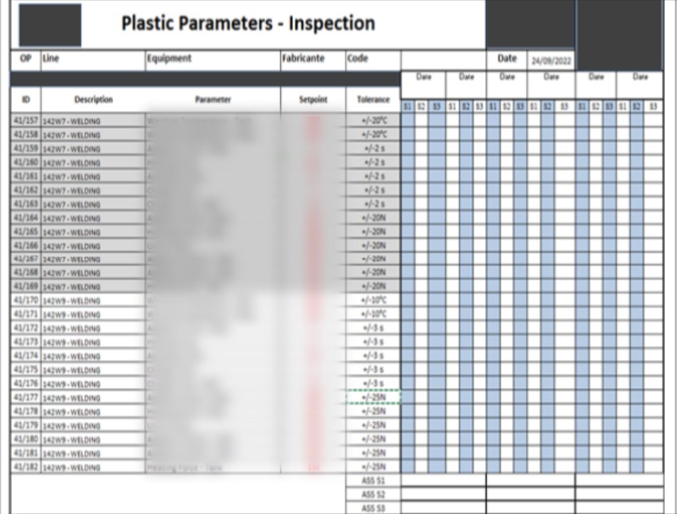
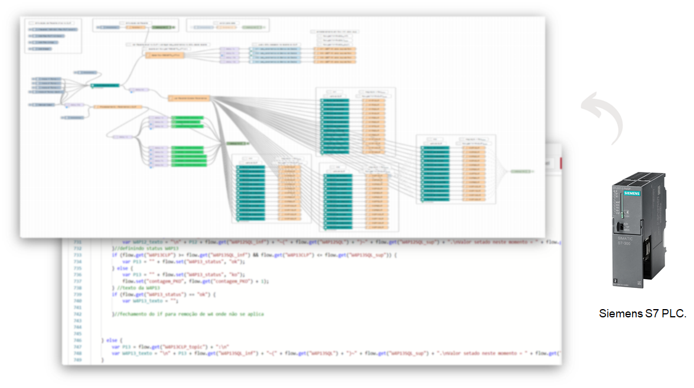
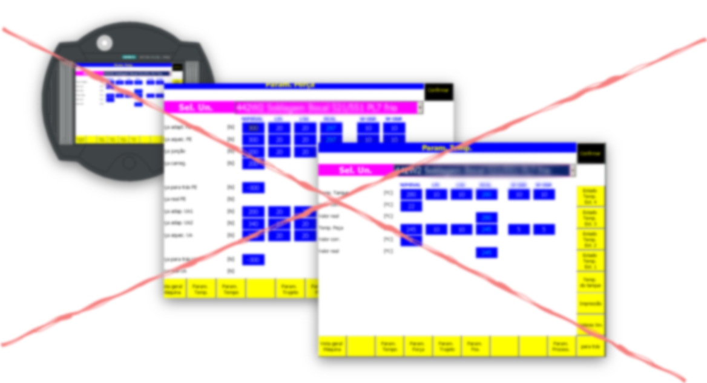
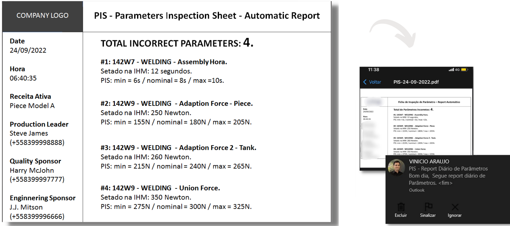
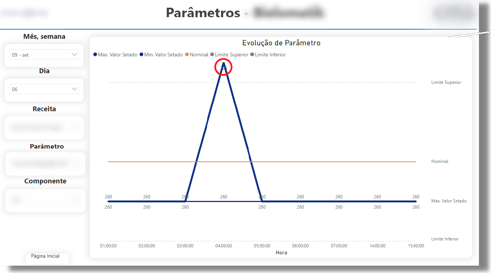

# PARAMETER CHECK AUTOMATION

In industrial environment, all machines has parameters to be defined and controlled. Usually, these parameters (and its min/max range) are defined by Enginnering Team and posted in **Parameters Inspection Sheet (PIS).** Production Team must follow these definitions.
 The issue starts when Production Team forget/don’t know/haven’t enough time to watch all these parameters. In this specific case, the procedure requires that the Production Leader checks more than 50 parameters on HMI and compare each with the PIS. It takes more than 30 minutes/shift and it’s an error prone process.

  
## PARAMETERS INSPECTION SHEET (PIS)
The process consist in verify around 50 parameters in HMI (human-machine interface), compare with PIS, check "OK" or "KO" for all parameters and finally ask help to engineering/quality sponsor, if necessary. The whole process take around 20min/shift and it an error prone process.

   PARAMETERS INSPECTION SHEET (PIS)

  

## THE SOLUTION
By using JavaScript/NodeJS/Node-Red, an automatic system has been created. It is able to read, in real time, the machine’s PLCs, compare with PIS and give a report. 

   PLC Reading.

  

## BENEFITS
Before the system, the Production Leader checks each parameter one by one (around 50), once per production hift. After the system has been implemented, **this manual procedure was no longer necessary**. The algorithm reads what is defined in HMI, compare with PIS and give a final report of what is correct or wrong.

   NO HMI.

  

The report is automatically sent (in PDF) by WhatsApp, Telegram or E-mail, according to the manager's choice.
 

   PDF Report.

  

## BONUS
By using the same system, a Dashboard (in Power Bi) has been created. It is able to monitor each parameter  volution (by hour, shift, day or month) and compare with its min and max range, defined by PIS.

   Parameters Monitoring.

  

## IMPROVEMENTS
Another real benefic of the job is the implementation of **Machine Learning**. Combining data of production, quality and parameters, is possible to apply statistical algorithms to find which parameter is most relevant to the quality of manufactured products. As final result, is possible to use Machine Learning to get better performance in production process.