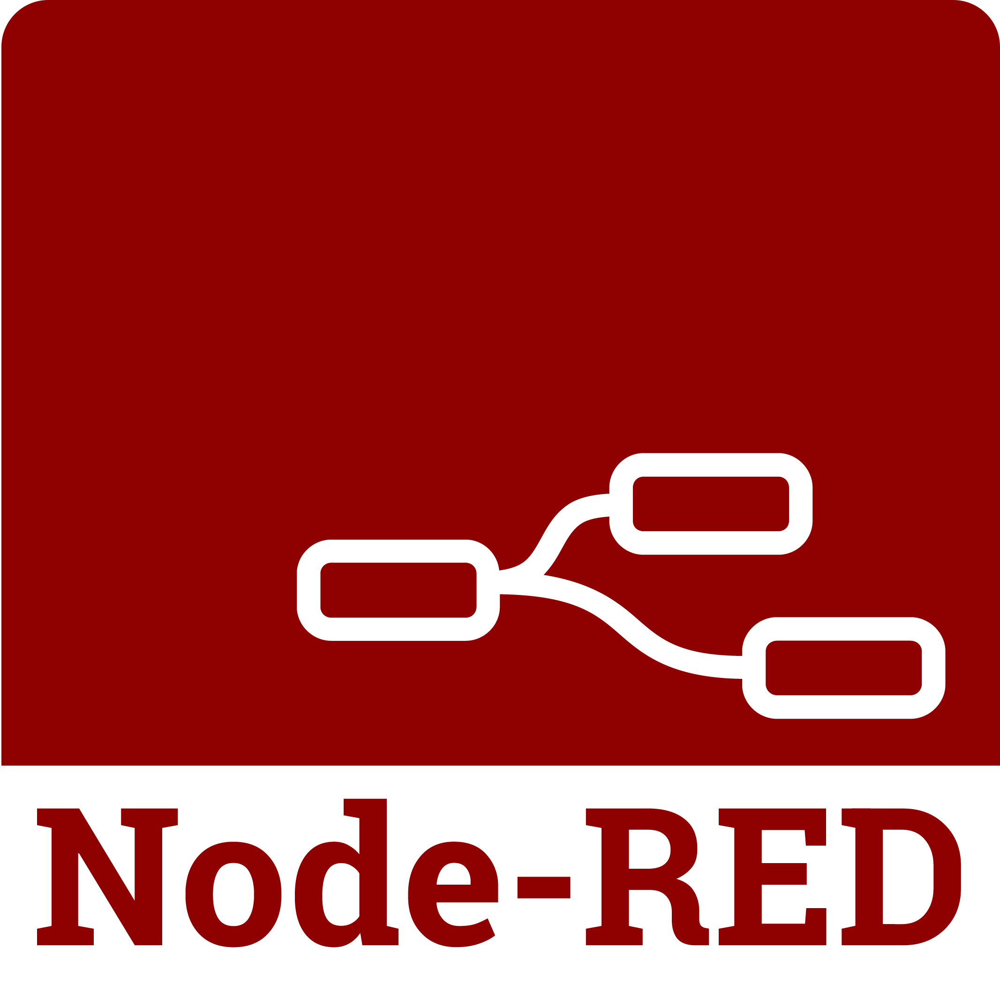
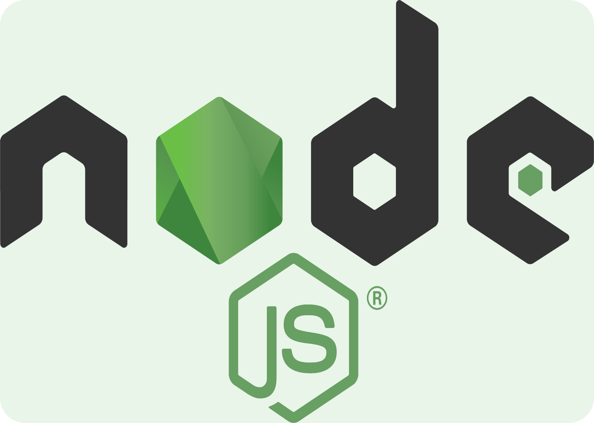

<h1 align="center">Node-Red and NodeJS </h1>
<h3 align="center">Some scripts I've made in NodeJS and its variant (Node-Red). The objetive is always to automate industrial process and apply Machine Learning algorithms, when possible.</h3>

 
<h3 align="left">Folders</h3>

1. <a href="https://github.com/VinicioAM/NodeJS_and_Node-Red/tree/main/Parameter%20Check%20Automation" target="_blank" rel="noreferrer"> **Parameter Check Automation**</a>
    * Some machines of Industrial Environment has process parameters to be controlled. Usually, the controll of these parameters is made in manual way. To avoid this, I've created a algorithm that make all the process automatically and give a final report in PDF.
    * **30% SIEMENS S7 PLC**   - Necessary to analyze how the machine and its parameters works on PLC.
    * **50% Node-Red**   - used to make all processing of the informations in PLC, compare with SQL Database and return the final report.
    * **10% NodeJS**  - Used to create bots that automatically send E-mails, WhatsApp and Telegram.
    * **10% SQL Server** - Necessary to create a Databse to store informations, like the PIS.
    * **Source code not avaliable** because it has a lot of internal company information. Anyway, feel free to contact me and I'll be glad to help.
 

2. <a href="https://github.com/VinicioAM/NodeJS_and_Node-Red/tree/main/WhatsApp_Bot" target="_blank" rel="noreferrer"> **WhatsApp Bot**</a>
    * A bot developed in NodeJS with whatsapp API to send messages. It doesn't need to connect to third parties software or proxies. When used with Node-Red, it has a lot of possibilities for automating processes and reports.
    * **15% Node-Red**   - used to write 'msg.txt' file. **Node-Red Source Code is not avaliable since it has some company's information.**
    * **85% NodeJS**  - The whole whatsapp bot was created in NodeJS. It reads 'msg.txt', rewrite when need and send through whatsapp. **Source code is avaliable**.

 