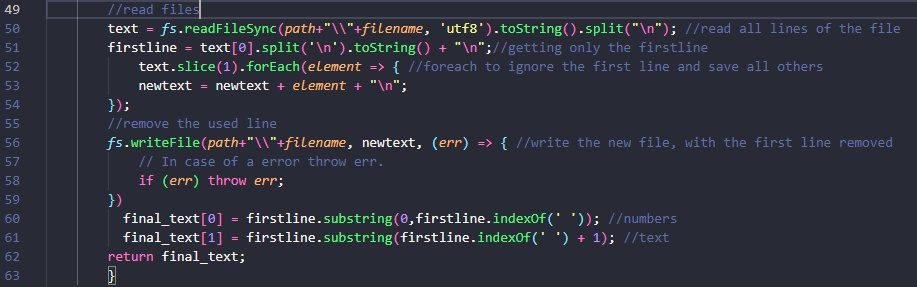
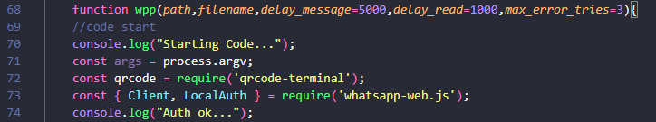
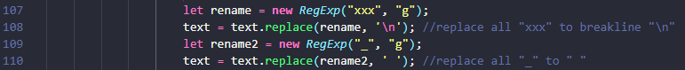
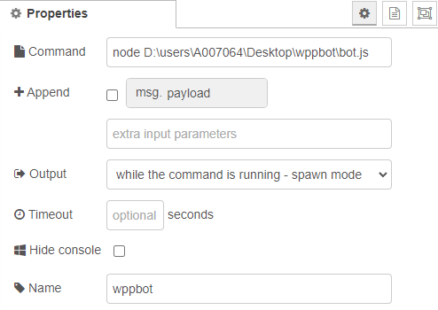
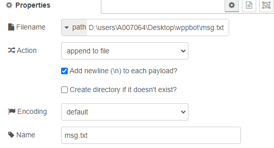

# WHATSAPP BOT

To improve communication, I created a whatsapp bot that sends automatic messages. The idea is integrate the bot with anothers scripts and get automatic informations from machines and robots, in a industrial environment (ex: a failure in a welding robot or the production report of the last shift).

As you can see <a href="https://github.com/VinicioAM/NodeJS_and_Node-Red/tree/main/Parameter%20Check%20Automation" target="_blank" rel="noreferrer"> **here**</a> and <a href="https://github.com/VinicioAM/IIoT/tree/main/Production_and_Scrap-Report" target="_blank" rel="noreferrer"> **here**</a>, I've created some scripts that collect data from PLCs/robots and all industrial machinery. Anyway, it must be delivered fast to managers. For this reason, I choose whatsapp instead e-mail, since we use whatsapp more often than e-mails. Telegram could be used too, but the managers preffer whatsapp.
There are a lot of APIs/ready-to-use whatsapp bots and anothers tools to make the process easier, avoiding the creating of my own whatsapp bot. Anyway, all free features are limited-use and can not handle my reports. 

 

## OPERATING MODE
First, I made the code so that for each message to be sent, the bot would initiate the connection, authenticate, send the message and finally close the application. This method was not effective because there was a lot of issues related to authentication with the WhatsApp server.
The solution was make a single connection, a single authentication and send message in loop by reading a .txt file which contains the message to be sent.

 

## THE CODE
The code is divided in 3 steps:
 **First:** a function (datefull) to get current datetime and formating.
 **Second:** a function (msg) to read a txt file where messages are stored, show below:

   Read/Write TXT file function.

  

The function msg() read every first line of a text file and return it to an array with 2 elements only: the final_text[0] contains all contact numbers to send through WhatsApp and final_text[1] contain the text to be sent. Note that what divide numbers from text is a space ' ' (line 60 and 61).

**Third:**  a function (wpp) to send the message:

   Wpp() function - arguments.

The code starts with some arguments to be provided: path to file, filename, delay between messages, delay between file reading and max tries in case of error.
    

And then:

     Wpp() function - replace text.

Note that the contact numbers must be separate with ',' (line 104) while in text to be sent, 'xxx' means a breakline (line 107) and '_' means space (line 109).

This way, adding line 60, 61, 104, 107 and 109, to script recognize contact numbers and message to send, the text file must follow this format:
 553199998888,553199997777 Text:xxxThe_triple_x_is_a_breakline,_while_underscore_is_a_space._There_is_a_space_between_contacts_and_text.

## HOW I'M USING
The bot can be used to send any automated message. Particularly, I'm using with Node-Red (nodeJS based application). Node-Red starts the bot and keep writing the file with messages. The scope of the messages I'm using you can find <a href="https://github.com/VinicioAM/NodeJS_and_Node-Red/tree/main/Parameter%20Check%20Automation" target="_blank" rel="noreferrer"> **here**</a> and <a href="https://github.com/VinicioAM/IIoT/tree/main/Production_and_Scrap-Report" target="_blank" rel="noreferrer"> **here**</a>.

     Exec node to start the bot.

  
The exec node starts the bot. It is trigged everytime the Node-Red starts. If some error that closes the bot occours, a trigger is sent to my machine, generating an alarm.

     Write node to write messages to txt file.

  

Note that the append option is choose, this way is possible to create a 'buffer' of messages to be send in order.

## IMPROVEMENTS
The next step is send images and documents files. I'll create it soon. 
 Some codes may not be the smartest way to be done, since I always try to use the fatest way that I know (check datefull() function).
